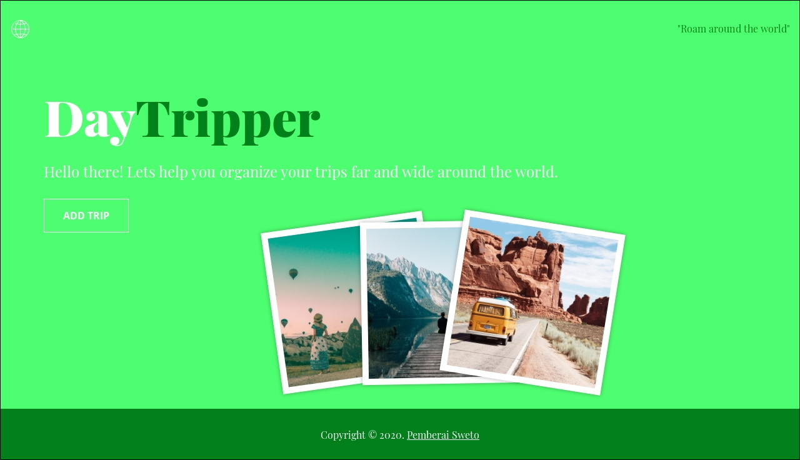

# Day Tripper

> This project showcases a travel app that allows users to choose any destination around the world and save the trip details.


## Day Tripper



Visit the website [here](https://day-tripper-app.herokuapp.com/)

## Installation

### Setup

Clone the source locally:

```sh
$ git clone https://github.com/thepembeweb/day-tripper.git
$ cd day-tripper
```

If you're on Debian or Ubuntu, you'll also need to install
`nodejs-legacy`:

Use your package manager to install `npm`.

```sh
$ sudo apt-get install npm nodejs-legacy
```

Install project dependencies:

```sh
$ npm install
```

Obtain keys for the below APIs

- [DarkSky](https://darksky.net/dev) - The Weather API used
- [Geonames](http://www.geonames.org/export/web-services.html) - The Geographical locations API used
- [Pixabay](https://pixabay.com/service/about/api/) - The Image API used

Create a new .env file and add the following environment variables for the following APIs:

```sh
DARKSKY_API_KEY=**************************
GEONAMES_USERNAME=**************************
PIXABAY_API_KEY=**************************
```

Start the server app:

```sh
$ npm start
```

Open another terminal and start the client app:

```sh
$ npm run dev
```

Alternatively you can view the live website [here](https://day-tripper-app.herokuapp.com/).

## Built With

- [HTML](https://en.wikipedia.org/wiki/HTML) - The markup language used
- [CSS](https://en.wikipedia.org/wiki/Cascading_Style_Sheets) - The style sheet language used
- [Javascript](https://en.wikipedia.org/wiki/JavaScript) - The programming language used
- [Node.js®](https://nodejs.org/) - The JavaScript runtime used
- [Express.js®](https://nodejs.org/) - The web application framework used
- [Webpack](https://webpack.js.org/) - The build tool used
- [DarkSky](https://darksky.net/dev) - The Weather API used
- [Geonames](http://www.geonames.org/export/web-services.html) - The Geographical locations API used
- [Pixabay](https://pixabay.com/service/about/api/) - The Image API used


## Authors

- **[Pemberai Sweto](https://github.com/thepembeweb)** - _Initial work_ - [Day Tripper](https://github.com/thepembeweb/day-tripper)

## License

[](http://badges.mit-license.org)

- This project is licensed under the MIT License - see the [LICENSE.md](LICENSE.md) file for details
- Copyright 2020 © [Pemberai Sweto](https://github.com/thepembeweb).

